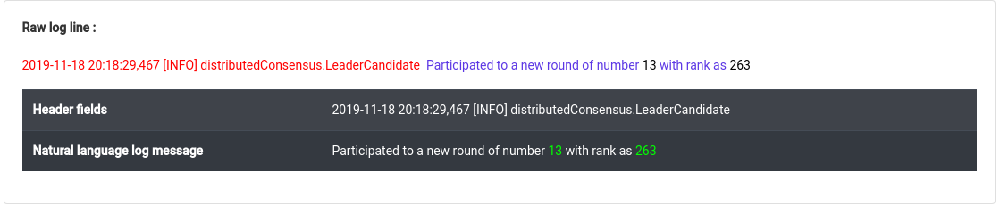
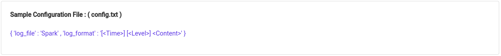

# vue4logs

Automatic Structuring of Textual System Logs

This tool can be used to generate a structured log report when given a raw log file as an input.

A log line in a log file may consist of,

- **Header fields** - Describing the pre-configured set of fields in a structured manner
- **Natural language** log message - Describing system event in natural language

For example,

This tool is able to identify the system events of log messages and generate a representative templates for identified events.

The tool requires,

1. A raw log file

2. A configuration file with header structure

## Dependencies

- pip install -r requirements.txt

## Running the Benchmarks

#### To create benchmarks with dataset specific parameter tuning (TYPE = 0): 
- python CreateBenchmark.py 0

#### To create benchmarks with single parameter for all datasets (TYPE = 1): 
- python CreateBenchmark.py 1

## Results

- Resultant structured log files will be saved at _**results/TYPE**_ directory.
